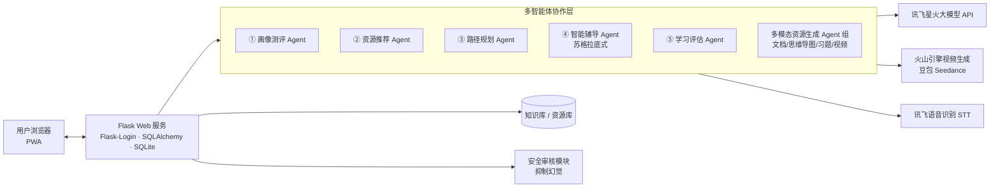

[README.md](https://github.com/user-attachments/files/32786022/README.md)
# Intelligent-Learning-Navigator
Smart Learning Navigator is a project dedicated to guiding learners through their educational journey, much like a navigator steering a ship through unknown waters. It combines intelligent learning technology with personalized guidance to help learners find direction, stay on course, and reach their goals.
<div align="center">

# 🎓 智学领航

**基于多智能体架构的 AI 个性化学习系统**

对话式画像构建 · 多模态资源生成 · 个性化路径规划 · 苏格拉底式辅导 · 学习效果评估

`Flask` `多智能体` `大模型应用` `Prompt 工程` `个性化学习`

</div>

---

## 📖 项目简介

智学领航是一个面向大学生的 AI 个性化学习平台，采用**多智能体（Multi-Agent）协作架构**，对接讯飞星火大模型，将"了解学生 → 生成资源 → 规划路径 → 实时辅导 → 评估反馈"整合为一个完整的学习闭环。

系统覆盖 50+ 学科（计算机、数学、医学、法学、艺术设计……），支持对话式八维学生画像、多模态学习资源一键生成、艾宾浩斯记忆曲线复习提醒与教师端学情管理，并内置内容安全审核机制抑制大模型幻觉。

## ✨ 核心功能

| 模块 | 说明 |
|---|---|
| 🗣️ **对话式画像测评** | 通过自然对话 + 入学测评，构建**八维学生画像**（知识掌握 / 理解深度 / 应用能力 / 分析评价 / 创新思维 / 自主学习力 / 学习节奏 / 认知层次），划分基础 → 中等 → 高等 → 大神四级学习层次 |
| 📚 **智能资源 / AI 视频生成** | 多智能体协作，一键生成课程文档、Mermaid 思维导图、练习题、实战案例、视频讲解、书籍与论文等**多模态学习资源** |
| 🧭 **路径规划** | 基于画像与测评结果，AI 规划从当前层次到下一层次的**个性化学习路径** |
| 👨‍🏫 **智能辅导** | 苏格拉底式引导教学，实时答疑而非直接给答案，支持**语音输入**（讯飞 STT） |
| 🌡️ **记忆温度** | 基于**艾宾浩斯遗忘曲线**实时监测知识点记忆状态，自动标记"稳固 / 需关注 / 危急 / 遗忘"，推送复习提醒 |
| ✏️ **错题攻克 & Python 练习** | 错题归档与针对训练；内置 Python 在线编程练习环境 |
| 📊 **效果评估** | 多维度学习效果评估报告，支持导出 PDF，动态调整学习层次 |
| 👩‍🏫 **教师端 & 管理端** | 教师查看班级学情分析与学生详情；管理员查看**内容安全审核日志** |
| 🛡️ **安全审核机制** | 对大模型输出进行安全审核与事实性约束，抑制幻觉，保障内容可靠 |

## 🖼️ 界面预览

| 学习中心 | 多智能体资源生成 |
|---|---|
|  |  |

| 登录页 | 记忆温度（艾宾浩斯） |
|---|---|
|  |  |

## 🏗️ 系统架构



**学习闭环**：画像测评 → 智能资源 → 路径规划 → 智能辅导 → 效果评估 → 动态调级，循环迭代。

## 🚀 快速开始

### 方式一：Windows 一键启动（推荐体验）

1. 安装 [Python 3.9+](https://www.python.org/downloads/)（安装时勾选 **Add Python to PATH**）
2. 双击 `智学领航_一键启动.bat`，等待自动完成环境准备（首次约 1–3 分钟）
3. 浏览器自动打开 `http://127.0.0.1:5000`，使用测试账号登录：**test / 123456**

> 一键启动默认开启演示模式（`DEMO_MODE=true`），无需配置任何 API Key 即可体验全部功能。

### 方式二：手动部署

```bash
# 1. 克隆项目
https://github.com/bazuayuweijing/Intelligent-Learning-Navigator.git

# 2. 创建虚拟环境并安装依赖
python -m venv venv
source venv/bin/activate        # Windows: venv\Scripts\activate
pip install -r requirements.txt

# 3.（可选）配置大模型 API —— 见下方 .env 说明
#    不配置则使用演示模式（mock 数据）

# 4. 启动
python app.py
# 浏览器访问 http://localhost:5000 ，测试账号 test / 123456
```

### 方式三：Docker 部署

```bash
cp .env.example .env   # 按需填写 API 配置
docker-compose up -d   # Gunicorn 生产模式，端口 5000
```

### 环境变量配置（.env）

不配置任何 Key 也可以以演示模式运行；接入真实能力后体验完整 AI 功能：

```ini
# ===== 基础 =====
SECRET_KEY=your-secret-key
PORT=5000
DEMO_MODE=false              # true = 演示模式（跳过真实 API 调用）

# ===== 讯飞星火大模型（对话/画像/资源/辅导）=====
SPARK_API_PASSWORD=your-spark-api-password

# ===== 讯飞语音识别 STT（智能辅导语音输入，可选）=====
STT_APPID=
STT_API_KEY=
STT_API_SECRET=

# ===== 火山引擎（AI 视频生成，可选）=====
ARK_API_KEY=                 # 火山方舟 API Key
VOLC_VIDEO_MODEL=doubao-seedance-1-0-pro-250528
```

## 📁 项目结构

```
智学领航/
├── app.py                  # Flask 主应用（路由、视图、核心业务）
├── config.py               # 配置：层次定义、八维画像维度、学科库
├── llm_client.py           # 共享 LLM 客户端（讯飞星火，支持演示模式）
├── evaluation_engine.py    # 学习效果评估引擎
├── knowledge_base.py       # 知识库
├── models.py               # SQLAlchemy 数据模型
├── recommender.py          # 资源推荐
├── agents/                 # 多智能体模块
│   ├── profiling_agent.py      # ① 画像测评
│   ├── resource_agent.py       # ② 资源推荐
│   ├── path_planning_agent.py  # ③ 路径规划
│   ├── tutor_agent.py          # ④ 智能辅导（苏格拉底式）
│   ├── assessment_agent.py     # ⑤ 学习评估
│   └── generator_agents.py     # 多模态资源生成
├── routes/                 # 蓝图：tutor / evaluate / teacher / admin
├── templates/              # Jinja2 页面（学习中心/辅导/评估/教师端/管理端…）
├── static/                 # 前端资源（含 PWA manifest）
├── docs/                   # 系统设计 / 开发 / 测试 / 部署文档
├── Dockerfile / docker-compose.yml
└── requirements.txt
```

## 🛠️ 技术栈

- **后端**：Python 3.9+ / Flask 3 / Flask-Login / Flask-SQLAlchemy（SQLite）
- **大模型**：讯飞星火 Chat Completions API（Prompt 工程、多智能体编排）
- **多模态**：火山引擎豆包视频生成、讯飞语音识别（WebSocket）
- **前端**：Jinja2 + 原生 JS，支持 PWA 离线安装
- **部署**：Gunicorn + Docker，Windows 一键启动脚本（自解压 + 自动建环境）

## 📌 Roadmap

- [ ] 引入 RAG 检索增强，提升资源生成的事实准确性（方案见 `docs/RAG_DECISION_SUPPLEMENT.md`）
- [ ] 更换/增加国产大模型适配层（OpenAI 兼容接口）
- [ ] 移动端适配优化

## 📄 License

本项目为个人学习与实践作品，仅供学习交流使用。

## 联系方式

如有问题或建议，欢迎提 Issue 或邮件联系：2810545779@qq.com
