# A3智学领航 - 系统设计文档

## 一、系统架构图

```mermaid
graph TB
    subgraph 前端层["🎨 前端层 (Bootstrap 5 + Jinja2)"]
        direction TB
        UI[用户界面]
        ProfileUI[画像构建界面]
        ResourceUI[资源生成界面]
        VideoUI[AI视频生成界面]
        CodeUI[编程练习界面]
        EvaluationUI[学习评估看板]
        TeacherUI[教师端看板]
        AdminUI[管理员后台]
    end

    subgraph 路由层["🚦 路由层 (Flask Blueprints + 主路由)"]
        direction TB
        MainRoutes[主路由 app.py<br/>画像/资源/视频/测评/错题/记忆温度]
        EvalBP[评估蓝图 evaluate_bp]
        TutorBP[辅导蓝图 tutor_bp]
        AdminBP[管理蓝图 admin_bp]
        TeacherBP[教师端蓝图 teacher_bp]
    end

    subgraph 智能体层["🧠 多智能体系统 (Agent System)"]
        direction TB
        Coordinator[GeneratorCoordinator<br/>统一调度器]
        ProfileBuilder[ProfileBuilderAgent<br/>画像构建Agent]
        DocAgent[DocAgent<br/>学习文档Agent]
        MindMapAgent[MindMapAgent<br/>思维导图Agent]
        QuizAgent[QuizAgent<br/>习题生成Agent]
        CaseAgent[CaseAgent<br/>案例分析Agent]
        TrapExamGen[TrapExamGenerator<br/>克星题Agent]
        VideoAgent[VideoAgent<br/>视频推荐+AI视频生成]
        BookPaperAgent[BookPaperAgent<br/>书籍论文推荐Agent]
        ResourceRec[ResourceRecommenderAgent<br/>多媒体推荐Agent]
        TutorAgent[TutorAgent<br/>智能辅导Agent]
    end

    subgraph 评估引擎层["📊 评估引擎 (Evaluation Engine)"]
        direction TB
        LLMEvaluator[LLMEvaluator<br/>AI评分模块]
        SafetyFilter[SafetyFilter<br/>安全审核+防幻觉]
        BehaviorTracker[BehaviorTracker<br/>行为追踪+学习积分]
        ProgressTracker[ProgressTracker<br/>进度追踪]
        PlanOptimizer[PlanOptimizer<br/>路径优化]
    end

    subgraph 数据层["💾 数据层"]
        direction TB
        SQLite[(SQLite<br/>learning.db)]
        KB[KnowledgeBase<br/>TF-IDF知识库<br/>7篇文档/4学科]
        STT[STT降级模块<br/>5层软隔离]
    end

    subgraph 外部服务["🌐 外部服务"]
        SparkLLM[讯飞星火<br/>Spark大模型]
        STTService[讯飞WebSocket<br/>语音转文字]
        VolcVideo[火山引擎<br/>豆包视频生成API]
    end

    %% 连接关系
    UI --> ProfileUI & ResourceUI & VideoUI & CodeUI & EvaluationUI & TeacherUI & AdminUI
    ProfileUI --> MainRoutes
    ResourceUI --> MainRoutes
    VideoUI --> MainRoutes
    CodeUI --> MainRoutes
    EvaluationUI --> EvalBP
    TeacherUI --> TeacherBP
    AdminUI --> AdminBP
    
    MainRoutes --> ProfileBuilder & Coordinator
    EvalBP --> TutorAgent
    TutorBP --> TutorAgent
    TeacherBP --> SQLite
    
    Coordinator --> DocAgent & MindMapAgent & QuizAgent & CaseAgent & VideoAgent & BookPaperAgent & ResourceRec & TrapExamGen
    
    ProfileBuilder --> LLMEvaluator
    LLMEvaluator --> SafetyFilter & BehaviorTracker
    BehaviorTracker -.-> AssessmentAgent
    PlanOptimizer --> LLMEvaluator
    
    LLMEvaluator --> SparkLLM
    TutorAgent --> SparkLLM
    ProfileBuilder --> SparkLLM
    SafetyFilter --> SparkLLM
    VideoAgent --> VolcVideo
    
    SQLite -.-> 所有数据持久化
    KB -.-> DocAgent & QuizAgent & CaseAgent
    STT -.-> STTService
```



## 二、功能结构图

```mermaid
graph TB
    subgraph 系统功能["A3智学领航 - 全功能结构"]
        direction TB
        
        subgraph 用户系统["👤 用户系统"]
            A1[注册/登录]
            A2[学生管理]
            A3[多角色支持<br/>学生/教师/管理员]
            A4[教师端独立账号<br/>is_teacher字段]
        end
        
        subgraph 画像系统["📝 画像构建系统"]
            B1[对话式画像构建<br/>智能头像+进度条]
            B2[8维画像模型<br/>≥6维度要求]
            B3[画像智能分析<br/>薄弱点/风格识别]
            B4[实时水平评估<br/>对话中动态评估]
            B5[小船形态实时更新<br/>船随画像分析变化]
        end
        
        subgraph 资源生成["📚 多Agent资源生成"]
            C1[学习文档生成<br/>DocAgent]
            C2[思维导图生成<br/>MindMapAgent]
            C3[配套习题生成<br/>QuizAgent]
            C4[案例分析生成<br/>CaseAgent]
            C5[克星题生成<br/>TrapExamGenerator]
            C6[视频推荐+AI视频生成<br/>VideoAgent]
            C7[书籍论文推荐<br/>BookPaperAgent]
            C8[多媒体资源推荐<br/>ResourceRecommenderAgent]
        end
        
        subgraph 学习流程["🔄 学习流程管理"]
            D1[学习路径规划<br/>PlanOptimizer]
            D2[个性化资源推送<br/>画像匹配推送]
            D3[智能辅导<br/>TutorAgent/苏格拉底式]
            D4[学习效果评估<br/>五维评估/调级建议]
            D5[反馈回路<br/>评估→调整→再评估]
            D6[编程练习+AI代码批改<br/>evaluate_python_code]
        end
        
        subgraph 教师端["👨‍🏫 教师端系统"]
            F1[学生总览看板<br/>等级分布/活跃统计]
            F2[学生列表管理<br/>画像等级分区]
            F3[学生详情<br/>进度监控/薄弱点分析]
            F4[班级数据分析<br/>analytics]
        end
        
        subgraph 管理系统["⚙️ 管理后台"]
            E1[数据看板]
            E2[用户管理]
            E3[系统配置]
            E4[DEMO_MODE切换]
            E5[安全日志<br/>admin_safety_logs]
        end
        
        subgraph 安全保障["🛡️ 安全系统"]
            G1[SafetyFilter<br/>白名单/敏感词]
            G2[幻觉检测<br/>LLM+规则双校验]
            G3[BehaviorTracker<br/>30天行为日志]
            G4[实时输入拦截<br/>学生输入安全审核]
        end
        
        subgraph 多模态接入["📱 多模态支持"]
            H1[Web端<br/>主界面]
            H2[语音输入<br/>STT 5层降级]
            H3[Mermaid图表<br/>思维导图渲染]
            H4[AI视频生成<br/>火山引擎豆包]
        end
        
        用户系统 --> 画像系统
        画像系统 --> 资源生成
        资源生成 --> 学习流程
        学习流程 --> 教师端
        学习流程 --> 管理系统
        安全保障 -.-> 画像系统 & 资源生成 & 学习流程
        多模态接入 -.-> 用户系统 & 资源生成 & 学习流程
    end
```



## 三、完整学习流程（用户视角）

```
注册/登录
    │
    ▼
对话式画像构建（7阶段对话 + 智能头像 + 进度条）
    │   - 询问个人信息、知识水平
    │   - 了解认知风格偏好
    │   - 识别薄弱维度
    │   - 确认学习目标
    │   - 构建8维画像
    │   - 配置生成偏好
    │   - 存储画像数据
    │   - 实时水平评估（对话中动态更新小船形态）
    │
    ▼
资源生成（全选或指定类型）
    │   - 选择学科/知识点
    │   - Coordinator调度8个Agent
    │   - 每个Agent根据画像调整内容
    │   - 文档/导图/习题/案例/视频/书籍论文/推荐/克星题
    │
    ▼
学习与练习
    │   - 查看学习文档
    │   - 展开思维导图（折叠/展开子节点）
    │   - 完成练习题（选择/填空/编程）
    │   - 编程练习 + AI代码批改
    │   - AI智能视频生成（火山引擎豆包）
    │
    ▼
智能辅导（遇到问题时）
    │   - 向TutorAgent提问
    │   - 苏格拉底式引导回答（辅导前10轮引导式提问）
    │   - 追问加深理解
    │
    ▼
学习效果评估
    │   - 五维能力评分
    │   - 雷达图可视
    │   - 调级建议（升级/巩固/维持/降级）
    │   - 评估报告PDF导出
    │   - 反馈回路验证（feedback-summary/verify）
    │
    ▼
记忆巩固（错题本 + 记忆温度）
    │   - 错题自动记录（wrong_questions）
    │   - 掌握标记（master）
    │   - 记忆温度计算（艾宾浩斯复习提醒）
    │   - 复习提醒推送（review_reminders）
    │
    ▼
反馈回路
    │   - 调整学习计划
    │   - 重新推送资源
    │   - 再评估验证进步
    │
    ▼
教师端监控（教师视角）
    │   - 学生总览（等级分布/今日活跃/7天趋势）
    │   - 学生详情（进度/薄弱点/错题分析）
    │   - 班级数据分析
    │
    ▼
循环提升
```

## 四、技术栈对比

| 选型 | 选用技术 | 备选方案 | 选择理由 |
|------|---------|---------|---------|
| Web框架 | Flask 3.0 | Django/FastAPI | 团队熟悉度高，开发效率优先 |
| 数据库 | SQLite | PostgreSQL/MySQL | 零运维成本，DEMO场景够用 |
| LLM | 讯飞星火Spark（lite） | GPT-4/文心一言 | 国产化要求，稳定，中文场景优秀 |
| AI视频生成 | 火山引擎豆包（doubao-seedance） | 即梦/可灵 | 火山方舟API稳定，模型质量高 |
| 前端渲染 | Bootstrap 5 + Jinja2 | React/Vue | 后端渲染减少团队复杂度 |
| 知识库 | TF-IDF | 向量检索/完整RAG | 10篇内文档TF-IDF足够，实现成本低 |
| 语音 | 讯飞WebSocket | 百度语音/阿里云 | 与LLM同一生态，对接成本低 |
| 图表 | Mermaid.js | ECharts/D3.js | 轻量无依赖，思维导图原生支持 |
| 容器化 | Docker | - | 部署简单，评分环境快速启动 |
| PDF导出 | fpdf2 | reportlab | 轻量，支持中文（自动查找中文字体） |

## 五、技术架构最简流

```
用户请求
    │
    ▼
Flask路由层 → 校验权限 → 校验参数
    │
    ▼
┌─────────────────────────────────────────┐
│          多智能体调度 (Coordinator)        │
│  profile context注入                     │
│  Agent分派（8个生成Agent）               │
│  TF-IDF知识增强                          │
│  LLM降级处理                             │
└─────────────────────────────────────────┘
    │
    ▼
┌─────────────────────────────────────────┐
│        SafetyFilter 安全审核              │
│  白名单过滤 → 敏感词检测 → 幻觉校验        │
└─────────────────────────────────────────┘
    │
    ▼
用户响应 ← Flask渲染 → 数据库持久化
```

## 六、核心模块说明

### 6.1 多智能体协作

**GeneratorCoordinator** 统一调度 8 个生成 Agent：
- document / mindmap / quiz / case / video / book_paper / multimedia / trap_exam
- 支持按需单类型生成 与 全自动全套生成两种模式
- 兼容旧接口 multimedia（返回完整视频+书籍+论文）

### 6.2 画像感知机制

- 画像数据（8维）注入每个Agent的prompt
- weak_points → content_style mapping 差异化生成
- 小船形态（4级）随画像分析实时更新
- 学习积分由 BehaviorTracker 累加

### 6.3 安全审核体系

- 学生输入实时拦截（敏感词库）
- AI输出净化（幻觉检测 LLM+规则双校验）
- 30天行为日志追踪
- 安全日志管理后台可查

### 6.4 教师端体系

- 独立教师账号（is_teacher字段），教师/管理员均可访问
- 学生等级分区、进度监控、错题薄弱点分析
- 班级维度数据统计

### 6.5 记忆巩固体系

- 错题本：自动记录错题、掌握标记、统计
- 记忆温度：基于艾宾浩斯遗忘曲线计算复习时机
- 复习提醒：到期知识点自动推送提醒
